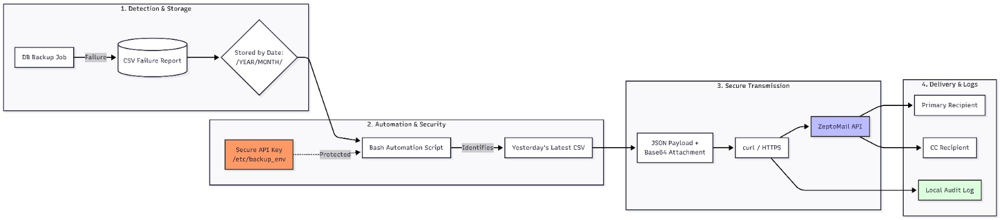

# 📧 Database Backup Failure Alerting via ZeptoMail API

[](https://opensource.org/licenses/MIT)
[](https://www.gnu.org/software/bash/)
[](https://www.zoho.com/zeptomail/)

Production-ready automated alerting system that detects database backup failures and sends email notifications with CSV reports via ZeptoMail API.

---

## 🎯 Problem Solved

Database backup jobs can fail silently, leaving critical data unprotected. This solution:

- ✅ **Automatically detects** backup failure CSV reports
- ✅ **Sends instant email alerts** with failure reports attached
- ✅ **Uses secure API-based delivery** (no SMTP credentials exposed)
- ✅ **Logs all actions** for auditing and troubleshooting
- ✅ **Production-ready** with proper error handling

---

## 🏗️ Architecture



### High-Level Workflow

```
┌─────────────────────────────────────────────────────────────┐
│  1. Database Backup Job Runs Daily                          │
│     └─> Generates CSV failure report if backup fails        │
└────────────────────┬────────────────────────────────────────┘
                     │
                     ▼
┌─────────────────────────────────────────────────────────────┐
│  2. CSV Stored in Date-Based Directory Structure            │
│     /home/ubuntu/DBBACKUPLOGS/LOCAL/YEAR/MONTH/             │
│     └─> LOCAL_2026-01-08_080001.csv                         │
└────────────────────┬────────────────────────────────────────┘
                     │
                     ▼
┌─────────────────────────────────────────────────────────────┐
│  3. Bash Automation Script (Cron/Manual)                    │
│     ├─> Identifies yesterday's latest failure CSV           │
│     ├─> Composes well-formatted alert email                 │
│     ├─> Attaches CSV report                                 │
│     └─> Sends via ZeptoMail API                             │
└────────────────────┬────────────────────────────────────────┘
                     │
                     ▼
┌─────────────────────────────────────────────────────────────┐
│  4. Email Delivered                                          │
│     ├─> TO: Primary recipient (operations team)             │
│     ├─> CC: Secondary recipient (monitoring team)           │
│     └─> Attachment: Latest failure CSV                      │
└─────────────────────────────────────────────────────────────┘
                     │
                     ▼
┌─────────────────────────────────────────────────────────────┐
│  5. All Actions Logged Locally                              │
│     ~/backup-test/backup_email.log                          │
└─────────────────────────────────────────────────────────────┘
```

---

## 🔐 Why ZeptoMail API (Instead of SMTP)

| Feature | ZeptoMail API | Traditional SMTP |
|---------|---------------|------------------|
| **Authentication** | 🔑 Token-based (secure) | 🔓 Username/Password |
| **Credential Exposure** | ✅ No credentials in scripts | ❌ Credentials required |
| **Deliverability** | ✅ High (99%+) | ⚠️ Variable |
| **Auditability** | ✅ API logs available | ⚠️ Limited |
| **Automation-Friendly** | ✅ Perfect for cron jobs | ⚠️ Connection issues |
| **Security Posture** | ✅ Modern & secure | ❌ Legacy protocol |

**Decision**: ZeptoMail API was selected to reduce credential exposure and improve security posture.

---

## 📁 Directory Structure

The script expects backup failure reports in this structure:

```
/home/ubuntu/DBBACKUPLOGS/LOCAL/
├── 2026/
│   ├── JAN/
│   │   ├── LOCAL_2026-01-08_080001.csv
│   │   ├── LOCAL_2026-01-09_080001.csv
│   │   └── LOCAL_2026-01-10_080001.csv
│   ├── FEB/
│   │   └── LOCAL_2026-02-01_080001.csv
│   └── MAR/
└── 2025/
    └── DEC/
        └── LOCAL_2025-12-31_080001.csv
```

**Format**: `LOCAL_YYYY-MM-DD_HHMMSS.csv`

---

## 🚀 Quick Start

### Prerequisites

- Ubuntu/Debian Linux server
- Root/sudo access
- ZeptoMail account with approved sender domain
- Database backup system generating CSV failure reports

### Step 1: Install Required Packages

```bash
sudo apt update
sudo apt install -y curl jq coreutils ca-certificates
```

**Package Purposes**:
- `curl` - Send HTTP requests to ZeptoMail API
- `jq` - Safely generate and validate JSON payloads
- `coreutils` - Required for base64 encoding
- `ca-certificates` - Secure HTTPS API communication

### Step 2: Configure ZeptoMail

Obtain the following from your ZeptoMail administrator:

| Item | Example |
|------|---------|
| **Domain** | `imssoftware.com.np` |
| **Approved Sender** | `backupfail@imssoftware.com.np` |
| **API Host** | `https://api.zeptomail.com` |
| **Send Mail Token** | `Zoho-enczapikey YOUR_API_KEY` |

⚠️ **Important**: The sender email must be verified and approved in ZeptoMail.

### Step 3: Secure API Key Setup

```bash
# Create secure environment file
sudo nano /etc/backup_env

# Add your API key
ZEPTO_API_KEY="Zoho-enczapikey YOUR_REAL_KEY"

# Protect the file
sudo chmod 600 /etc/backup_env
sudo chown root:root /etc/backup_env
```

**Why Environment Variables?**
- ✅ Prevents API key exposure in scripts
- ✅ Avoids accidental commits to Git
- ✅ Follows 12-Factor App security principles

### Step 4: Deploy the Script

```bash
# Create working directory
mkdir -p ~/backup-test
cd ~/backup-test

# Copy the backup alert script
# (Assuming script is named: backup_alert.sh)
chmod +x backup_alert.sh

# Test run
source /etc/backup_env
./backup_alert.sh
```

### Step 5: Schedule with Cron

```bash
# Edit crontab
crontab -e

# Add daily execution at 9:00 AM
0 9 * * * source /etc/backup_env && /home/ubuntu/backup-test/backup_alert.sh >> /home/ubuntu/backup-test/backup_email.log 2>&1
```

---

## 📧 Email Alert Logic

### Trigger Conditions

- ✅ Script runs daily (manual or cron)
- ✅ Checks yesterday's backup failure CSV
- ✅ If **no CSV exists** → exits silently (no spam)
- ✅ If **CSV exists** → sends alert

### Email Format

**Subject**: `🚨 Database Backup Failure - [YYYY-MM-DD]`

**Body**:
```
Database Backup Failure Alert

Date: YYYY-MM-DD
Server: hostname
Status: FAILED

The attached CSV contains details of the backup failure.
Please investigate immediately.

---
Automated Alert System
```

**Recipients**:
- **TO**: Primary operations email
- **CC**: Secondary monitoring email

**Attachment**: Latest failure CSV from yesterday

---

## 📊 Logging & Observability

All execution results are logged to:
```
~/backup-test/backup_email.log
```

**Log Contents**:
- ✅ Successful email sends
- ✅ Missing CSV cases
- ✅ API errors (if any)
- ✅ Environment variable issues
- ✅ Timestamps for all actions

**Example Log Entry**:
```
[2026-01-10 09:00:01] Checking for backup failure CSV...
[2026-01-10 09:00:01] Found: LOCAL_2026-01-09_080001.csv
[2026-01-10 09:00:02] Email sent successfully via ZeptoMail API
[2026-01-10 09:00:02] Alert delivered to: ops@company.com
```

---

## 🔒 Security Considerations

| Security Feature | Implementation |
|------------------|----------------|
| **API Key Storage** | ✅ Environment variable (not in script) |
| **SMTP Credentials** | ✅ Not used (API-based) |
| **HTTPS Enforcement** | ✅ All API calls over HTTPS |
| **File Permissions** | ✅ `/etc/backup_env` set to 600 |
| **Minimal Dependencies** | ✅ Only 4 packages required |
| **No Hardcoded Secrets** | ✅ All sensitive data externalized |

**Suitable For**:
- ✅ Production servers
- ✅ Compliance-sensitive environments
- ✅ Automated CI/CD pipelines
- ✅ SOC 2 / ISO 27001 environments

---

## ✅ Pre-Deployment Checklist

Before running in production:

- [ ] Required packages installed (`curl`, `jq`, `coreutils`, `ca-certificates`)
- [ ] ZeptoMail sender email approved and verified
- [ ] `ZEPTO_API_KEY` exported in `/etc/backup_env`
- [ ] CSV directory structure exists (`/home/ubuntu/DBBACKUPLOGS/LOCAL/`)
- [ ] Database backup job generates failure CSVs
- [ ] Log directory writable (`~/backup-test/`)
- [ ] Bash script executable (`chmod +x backup_alert.sh`)
- [ ] Test email sent successfully
- [ ] Cron job scheduled (if automated)

---

## 🛠️ Troubleshooting

### No Email Received?

```bash
# Check log file
tail -50 ~/backup-test/backup_email.log

# Verify API key is set
echo $ZEPTO_API_KEY

# Test API connectivity
curl -X POST https://api.zeptomail.com/v1.1/email \
  -H "Authorization: $ZEPTO_API_KEY" \
  -H "Content-Type: application/json"

# Check CSV exists
ls -lh /home/ubuntu/DBBACKUPLOGS/LOCAL/$(date -d yesterday +%Y)/$(date -d yesterday +%b | tr '[:lower:]' '[:upper:]')/
```

### API Key Not Found?

```bash
# Source the environment file
source /etc/backup_env

# Verify it's set
echo $ZEPTO_API_KEY
```

### Wrong CSV Attached?

The script always selects the **latest** CSV from yesterday's directory. If multiple CSVs exist, it picks the most recent by timestamp.

---

## 📈 Future Enhancements

Potential improvements:

- [ ] **Multi-CSV Support** - Attach all failure CSVs from yesterday
- [ ] **Duplicate Prevention** - Track sent alerts to avoid spam
- [ ] **Slack/Teams Integration** - Add webhook fallback
- [ ] **Server Metadata** - Include hostname, IP, and system info
- [ ] **Retry Logic** - Retry failed API calls with exponential backoff
- [ ] **HTML Email Templates** - Rich formatting with tables
- [ ] **Dashboard Integration** - Send metrics to Grafana/Prometheus

---

## 📁 Repository Files

- **`backup_alert.sh`** - Main Bash script for email alerting
- **`README.md`** - This file
- **`zeptoimg.jpeg`** - System flow diagram
- **`example_env`** - Example environment variable file
- **`example_csv/`** - Sample backup failure CSV files

---

## 📝 Operational Notes

### Manual Execution
```bash
source /etc/backup_env
./backup_alert.sh
```

### Cron Execution
```bash
# Daily at 9:00 AM
0 9 * * * source /etc/backup_env && /home/ubuntu/backup-test/backup_alert.sh >> /home/ubuntu/backup-test/backup_email.log 2>&1
```

### Testing Without Sending Email
Add a dry-run mode to the script:
```bash
DRY_RUN=true ./backup_alert.sh
```

---

## 🙏 Acknowledgments

- [ZeptoMail API](https://www.zoho.com/zeptomail/) - Reliable transactional email service
- [jq](https://stedolan.github.io/jq/) - JSON processing tool
- [curl](https://curl.se/) - HTTP client

---

## 📧 Support

For issues or questions:
- Check the log file: `~/backup-test/backup_email.log`
- Review ZeptoMail API documentation
- Verify sender email is approved in ZeptoMail dashboard

---

## 📄 License

MIT License - See LICENSE file for details

---

**Built for production environments requiring reliable, secure, and automated backup failure alerting.**
